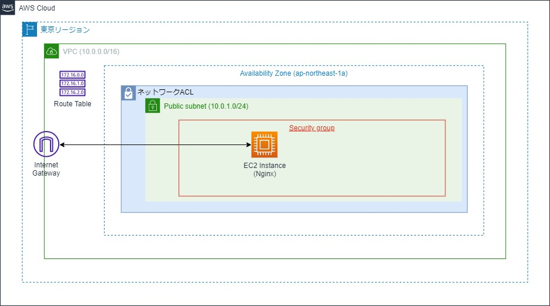

# AWSのパブリックサブネット上にNginxを構築する手順

AWSのパブリックサブネット上にNginxを構築する手順を記載する<br>
簡易的なWebアプリケーション環境を構築したい場合に利用することを想定

## 事前準備
- Terraformのインストール
- AWS アカウントの準備
- AWS CLIのインストール

## システム構成図
構築するシステム構成は以下の通り


## 使用方法
1. project配下に移動する
2. 以下のコマンドを実行する
```
terraform init
terraform plan
terraform apply
```
3. パブリックIPアドレスを確認する
```
terraform show | Select-String -Pattern "public_ip"
```
or
```
terraform show | grep "public_ip"
```
1. ブラウザで確認したパブリックIPアドレスにアクセスする
※EC2インスタンスの起動に5分程度かかる場合があるため、しばらく待ってからアクセスすること

2. EC2インスタンスにアクセスしたい場合は以下のコマンドを実行する
```
ssh -i .\hanson_key.pem ec2-user@パブリックIPアドレス
```

## ライセンス
MIT.